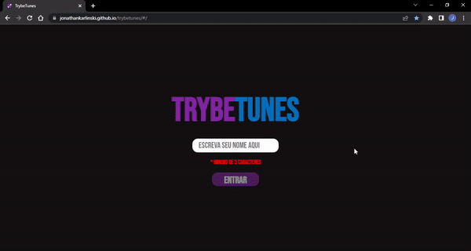

# Projeto TrybeTunes

Nesse projeto desenvolvi uma aplicação capaz de reproduzir músicas das mais variadas bandas e artistas, criar uma lista de músicas favoritas e editar o perfil da pessoa usuária logada.

[Testar Projeto](https://jonathankarlinski.github.io/trybetunes/#/)

## Conhecimentos Utilizados

- React.Js
- HTML
- SCSS
- Java Script
- Fazer requisições e consumir dados vindos de uma API
- Utilizar os ciclos de vida de um componente React
- Utilizar a função setState de forma a garantir que um determinado código só é executado após o estado ser atualizado
- Utilizar o componente BrowserRouter corretamente
- Criar rotas, mapeando o caminho da URL com o componente correspondente, via Route
- Utilizar o Switch do React Router
- Criar links de navegação na aplicação com o componente Link

## Demonstração

## Feedback

Se você tiver algum feedback, posso ser encontrado em

  
  
